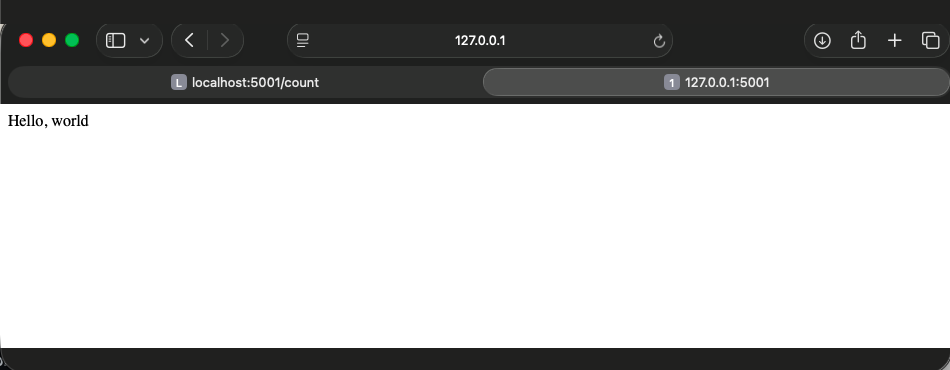
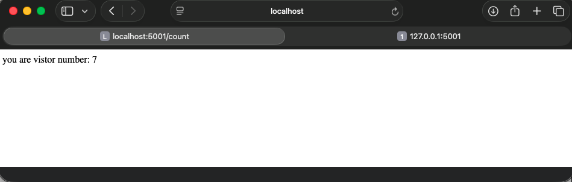

# Flask + Redis Visit Counter (Docker Compose)
A multi-container application built for the CoderCo Containers Challenge.
A Python Flask web app runs in one container and uses Redis, running in a second container, to store a visit counter. Docker Compose builds and runs both services together on a shared network.

# Architecture

Browser
   │  <http://localhost:5001>
   ▼
┌──────────────────────┐        host: redis, port 6379        ┌──────────────────────┐
│  web (Flask)         │ ───────────────────────────────────► │  redis (official     │
│  built from my       │                                      │  redis image)        │
│  Dockerfile          │                                      │  stores visitor_count│
│  listens on 5001     │                                      │  port NOT published  │
└──────────────────────┘                                      └──────────────────────┘
          └──────────────── Compose default network ────────────────┘

- web is published to the host on port 5001 so the browser can reach it.
- redis is not published to the host. Only the web container can reach it, using the Compose service name redis as the hostname.

# How to run
Requirements: Docker Desktop (or Docker Engine with the Compose plugin).
docker compose up --build
​
Then open:
Welcome page: http://localhost:5001
Visit counter: http://localhost:5001/count (increments on every refresh)
Stop and remove everything:
docker compose down
​
# Note on the port
The challenge brief tests on port 5000. This project uses 5001 instead, because on macOS port 5000 is taken by the AirPlay Receiver service. Everything else matches the brief.

# Screenshots

Known limitations
The count resets when the stack is removed with docker compose down, because Redis data is not stored in a volume yet. (Bonus task: named volume.)
The Redis hostname is hardcoded as redis in app.py, so the app only connects when run through Compose. (Bonus task: environment variables.)
Uses Flask's development server, which is not meant for production.

# My approach
I built the project one piece at a time, testing each piece before moving on.

1. Flask app first, on my Mac. I wrote app.py in Python, importing Flask and the redis Python library. The first route (/) returns a welcome message. I ran it locally with python3 app.py to confirm it worked before involving Docker.
2. Redis in a container, tested locally. I started Redis from the official image with docker run, publishing port 6379 so the app on my Mac could reach it on localhost. I then added the second route (/count), which uses Redis's INCR command (r.incr in Python) to add 1 to the visit count and return the new number.
3. Dockerfile for the Flask app. I wrote a Dockerfile using python:3.13-slim (matching the Python version I tested with), copied the app in, installed flask and redis, and set it to start the app. Redis didn't need a Dockerfile, because it uses the official image.
4. Docker Compose for both services. I defined two services, web (built from my Dockerfile) and redis (the official image). Inside a container, localhost means that container itself, so I changed the app to connect to Redis using the service name redis instead.
5. Tested with docker compose up --build, and confirmed both routes in the browser and the logs.

# Challenges and how I solved them
- from flask import flask → ImportError → the class is Flask (capital F)
- Server didn't start, no error → 'main' instead of '__main__'
- Port 5000 already in use on macOS → AirPlay Receiver → used 5001
- App couldn't reach Redis once containerised → localhost inside a container means the container itself → used the Compose service name redis
- Confused what needs a Dockerfile → only my own app (Flask); Redis uses the official image
- docker build mistakes → t names an image (-name is for docker run); build takes one . (the build context)
- Compose typos (port vs ports, depends_on) → keys must be exact
- Leftover containers holding ports → check docker ps before and after; clean up with docker compose down
- Two nested copies of the repo → git only sees the repo you're standing in
- Used Google AI with the full requirement for /count → lesson: search for the smallest gap, then make sure I understand every line

# What I learnt
- Dockerfile (builds one image) vs Compose (runs several containers)
- How containers find each other on a Compose network
- Port publishing: container port vs host port
- Reading error messages and logs before asking for help
